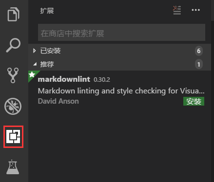

### VScode常用功能说明
vscode全称Visual Studio Code 是微软开发一款IDE，作为一款前端编辑器功能很强大，灵活，可以根据个人喜好选择扩展插件，而且还支持多种开发语言。
#### VScode 常用快捷键
1. "Ctrl"+"B"：隐藏/显示左侧导航栏
2. "Ctrl"+"+": 放大字体
3. "Ctrl"+"-": 缩小字体
4. "Ctrl"+"O": 打开文件 
5. "Ctrl"+"N": 新建文件
6. "Ctrl"+"S": 保存文件
7. "Ctrl"+"Shift"+"Y"：隐藏/显示底部控制台
8. "Ctrl"+"P": 快速打开最近打开的文件
#### VScode 插件安装和卸载
##### 安装插件
1. 找到左侧导航栏中的如下图红框所示的按钮：

##### 卸载插件
